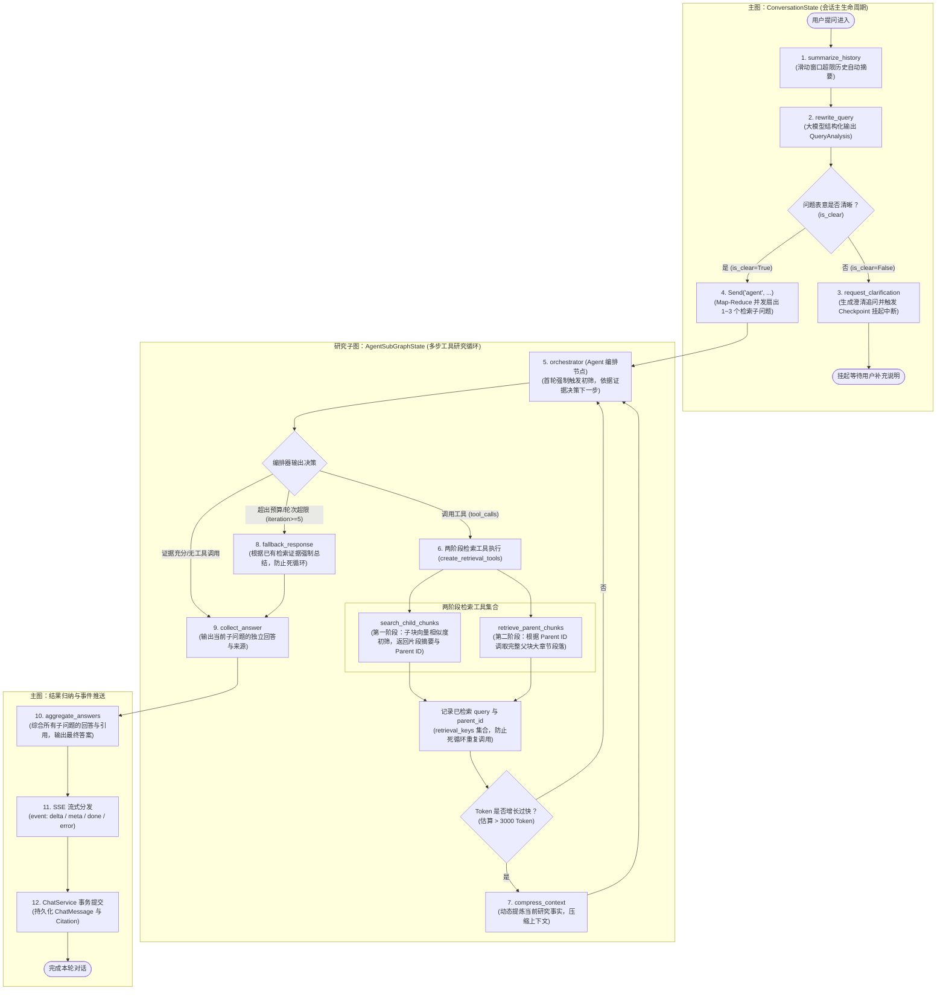

# BiYou (必有) —— 本地优先的 Agentic RAG 个人知识库问答系统

[演示视频](https://www.bilibili.com/video/BV1u1un6vEhi/?share_source=copy_web&vd_source=b38d30b9afa4cdb7d6538c4c2978a4c8) | [前端参考 rag-web-ui](https://github.com/rag-web-ui/rag-web-ui) | [Agentic RAG 架构参考](https://github.com/GiovanniPasq/agentic-rag-for-dummies)

BiYou 是一款本地优先、开箱即用的个人知识库问答系统。系统采用前后端分离架构，结合 **LangGraph** 构建了具备多步检索、意图澄清、Map-Reduce 子问题拆解、上下文动态压缩与双阶段（Parent-Child）调度的 Agentic RAG 智能工作流。

---

## 1. Agentic RAG 双层图状态机工作流 (LangGraph)

BiYou 的问答引擎基于 **LangGraph SDK** 构筑，由 **主图 (ConversationState)** 与 **Agent 研究子图 (AgentSubGraphState)** 构成的双层状态机驱动，实现了从问题分析、多步两阶段工具调用、循环防呆、动态上下文压缩到最终答案聚合的完整 Agentic 闭环。



### 核心工作流节点职责：
1. **`summarize_history`**：检测多轮对话历史 Token 长度，当超出窗口预算时自动增量压缩历史对话为紧凑摘要。
2. **`rewrite_query`**：结合上下文与大模型结构化输出（`QueryAnalysis`），识别指代不明的问题（触发澄清中断 `request_clarification`），并将复合提问拆解为 1~3 个针对性的检索子问题。
3. **`orchestrator` (研究编排器)**：驱动多步自主工具调用，首轮强制检索，后续根据已获取证据决定继续深入、调取父块或得出结论。
4. **两阶段检索工具 (`create_retrieval_tools`)**：
   - `search_child_chunks`：在 LanceDB 中做向量初筛，返回高相关子块与对应 `parent_id`；
   - `retrieve_parent_chunks`：根据 `parent_id` 提取完整大段落，保证大模型获取完整上下文。
5. **`compress_context`**：在 Agent 研究多轮导致 Token 膨胀时，自动提炼事实摘要，避免超出上下文窗口。
6. **`fallback_response`**：当 Agent 达到 5 轮迭代上限时平滑降级，仅基于已有检索证据给出最佳答复，杜绝死循环。
7. **`aggregate_answers`**：将并发子问题的研究结果与来源归纳整合为通顺完整的最终答案，输出标准引用角标。

---

## 2. 两阶段切片与精准召回体系 (Parent-Child)

为了彻底解决传统 RAG “切片太小丢失上下文、切片太大检索不精准” 的两难问题，BiYou 实现了两阶段分块策略：

- **Markdown 标题树感知切分**：基于 `MarkdownHeaderTextSplitter` 提取天然章节树，保留文档结构层次。
- **小父块自适应合并 (`_merge_small_parents`)**：将碎片短小段落自动合并，并将标题路径规范化为 `章节1 -> 章节2`。
- **超大父块平滑拆分 (`_split_large_parents`)**：严格控制父块上限（默认 3000 字符），防止超出模型承载。
- **细粒度子块切分 (`RecursiveCharacterTextSplitter`)**：每个父块切分为 500 字符、50 字符重叠的子块（Child），仅子块经 `FastEmbed` 向量化存入本地 `LanceDB`。
- **精准区间引用**：记录每个子块在父块中的 `start_offset` / `end_offset`，前端引用面板可精准高亮对应证据段落。

---

## 3. 本地快速启动

### 方式一：根目录一键启动（推荐）

```bash
cp backend/.env.example backend/.env
# 编辑 backend/.env 填写 BIYOU_LLM_API_KEY
./scripts/dev.sh
```

- 前端界面：`http://127.0.0.1:4173`
- 后端服务：`http://127.0.0.1:8001`
- 健康检查：`http://127.0.0.1:8001/api/v1/health`

---

### 方式二：分模块手动启动

#### 1. 启动后端 (Python / FastAPI)
统一使用 `uv` 管理依赖与环境：

```bash
cd backend
uv sync --extra dev
cp .env.example .env
# 编辑 .env 填写 BIYOU_LLM_API_KEY 与模型参数
uv run uvicorn app.main:app --reload --port 8001
```

#### 2. 启动前端 (React / Vite)

```bash
cd frontend
npm install
npm run dev
```

---

## 4. 核心 REST / SSE API 概览

### 知识库管理 (`/api/v1/knowledge-bases`)
- `POST /api/v1/knowledge-bases`：创建新知识库
- `GET /api/v1/knowledge-bases`：获取知识库列表与统计信息
- `GET /api/v1/knowledge-bases/{id}`：获取知识库详情
- `PATCH /api/v1/knowledge-bases/{id}`：更新知识库名称/描述
- `DELETE /api/v1/knowledge-bases/{id}`：删除知识库

### 文档管理 (`/api/v1/knowledge-bases/{id}/documents`)
- `POST /api/v1/knowledge-bases/{id}/documents?filename=xxx.md`：流式上传并触发分块向量化
- `GET /api/v1/knowledge-bases/{id}/documents`：获取文档列表与切片进度
- `DELETE /api/v1/knowledge-bases/{id}/documents/{doc_id}`：删除文档及关联向量
- `POST /api/v1/knowledge-bases/{id}/documents/{doc_id}/reprocess`：重新处理/切片文档
- `GET /api/v1/knowledge-bases/{id}/documents/{doc_id}/chunks`：分页浏览文档父子切片

### 智能会话问答 (`/api/v1/conversations`)
- `POST /api/v1/conversations`：创建新会话
- `GET /api/v1/conversations`：会话列表分页
- `GET /api/v1/conversations/{id}/messages`：加载会话历史消息
- `POST /api/v1/conversations/{id}/messages/stream`：**SSE 流式问答接口**（驱动 LangGraph 输出打字机文本与思考过程）
- `POST /api/v1/conversations/{id}/messages/{msg_id}/regenerate`：重新生成回答
- `PUT /api/v1/conversations/{id}/messages/{msg_id}/feedback`：用户点赞 (👍) / 点踩 (👎) 评价反馈

---

## 5. 本地开发与质量检查

```bash
cd backend
# 代码静态检查与格式化
uv run ruff check app tests
uv run ruff format --check

# 执行全量单元测试与集成测试
uv run pytest
```
