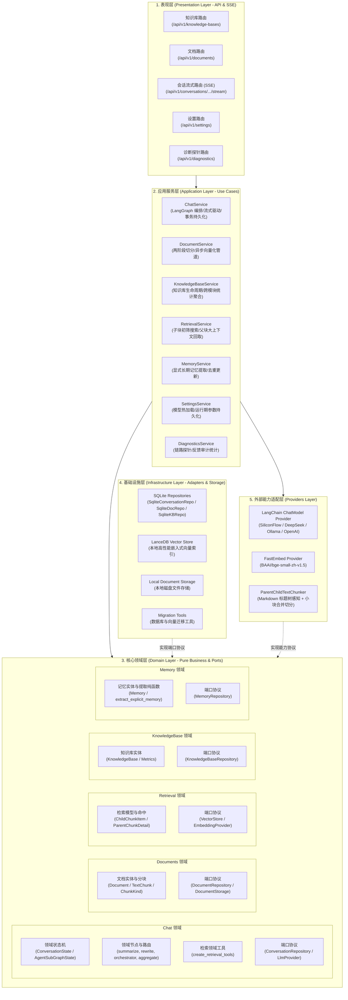
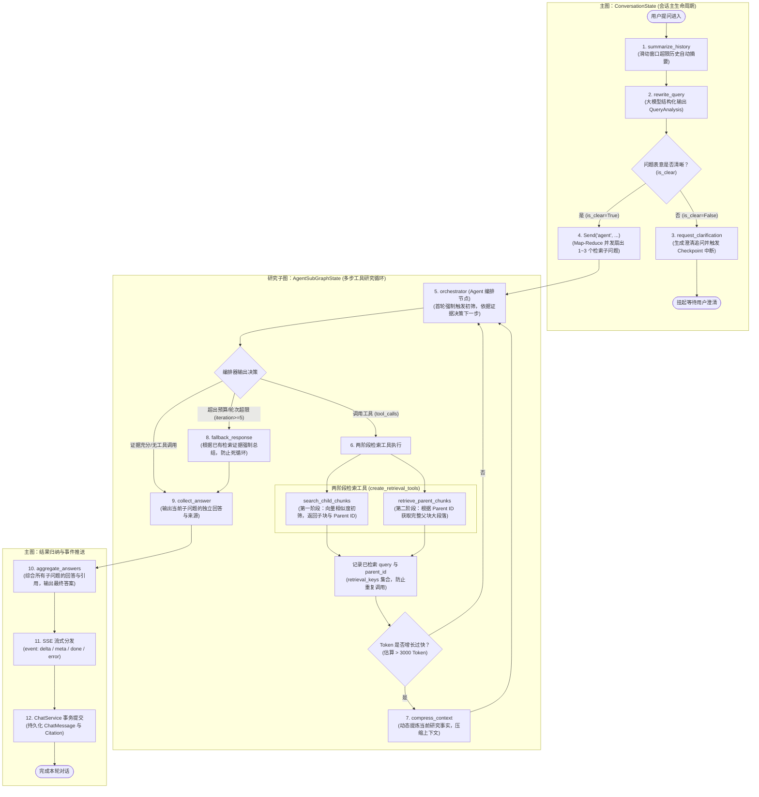

# BiYou 本地知识库问答系统 —— 架构设计文档

本文档详细说明 BiYou 本地 Agentic RAG 问答系统的**服务端总体分层架构**与**基于 LangGraph 的 Agentic RAG 双层图状态机架构**。

---

## 1. 服务端总体 DDD 分层架构图

服务端严格遵循 **DDD（领域驱动设计）** 原则，将核心业务规则与外部数据库、模型厂商、Web 框架彻底解耦，依赖方向自外向内单向依赖：

---

## 2. LLM Chat 的 Agentic RAG 双层图状态机架构图

BiYou 借鉴并融合了 `agentic-rag-for-dummies` 的核心思想，使用 **LangGraph SDK** 构筑了具备**意图拆解重写、两阶段多步工具调用研究循环、动态上下文压缩、超预算降级兜底及最终多路归纳**的双层状态机。

---

## 3. 关键架构设计与运行机制详解

### 3.1 两阶段切分与按需检索（Two-Stage Parent-Child Retrieval）
- **切分阶段 (`ParentChildTextChunker`)**：
  1. 使用 `MarkdownHeaderTextSplitter` 提取天然章节树；
  2. 自动合并过小父块（`_merge_small_parents`，将碎片合并并更新标题路径 `章节1 -> 章节2`）；
  3. 递归切分子块（`RecursiveCharacterTextSplitter`，500 字符，50 字符重叠），子块携带 `parent_id`。
- **检索阶段 (`create_retrieval_tools`)**：
  1. **第一阶段初筛 (`search_child_chunks`)**：基于 LanceDB 向量计算，快速检索出语义最匹配的细粒度 Child 片段，返回概要、相似度与 `parent_id`；
  2. **第二阶段大上下文获取 (`retrieve_parent_chunks`)**：Agent 根据初筛线索，按需调取完整的 Parent 章节段落，彻底消除断章取义。

### 3.2 自适应查询分析与 Map-Reduce 扇出（Query Analysis & Map-Reduce）
- 在 `rewrite_query` 节点中，利用大模型的结构化输出能力（`with_structured_output(QueryAnalysis)`）：
  - **模糊代词识别**：若提问严重缺失主语或指代不明（如“那个怎么用”），标记 `is_clear=False` 并给出澄清反问，触发 LangGraph 的 Checkpoint 中断，等待用户补充说明；
  - **复杂问题拆解**：若问题清晰，自动将其重写并分解为 1~3 个相互独立的子问题，通过 LangGraph 的 `Send("agent", ...)` 并发分发给子图 Agent 进行独立研究。

### 3.3 工具循环治理与动态压缩（Loop Safety & Context Compression）
- **防死循环与去重**：子图维护 `retrieval_keys: Annotated[set[str], set_union]` 状态，记录已执行过的检索词和已获取的父块 ID，禁止重复调取。
- **动态上下文压缩 (`compress_context`)**：当检索证据累计导致 Token 估算超出阈值时，自动触发压缩节点，提取事实、过滤工具冗余，将上下文提炼至 300~600 字结构化摘要后继续研究。
- **硬限制降级 (`fallback_response`)**：当迭代轮次达 5 次或工具调用达 8 次时，平滑降级至兜底归纳节点，避免大模型陷入死循环。

### 3.4 最终归纳与平滑流式推送（Aggregation & SSE Streaming）
- 所有子问题的研究结果汇总至 `aggregate_answers`，提炼连贯答案并严格按格式附加 `来源：\n- 文件名.ext`。
- `ChatService` 监听 LangGraph 产生的实时更新，通过标准 Server-Sent Events（SSE）将打字机文本（`delta`）、思考状态、引用来源（`Citation`）即时推送到前端界面。

---

## 4. 技术栈总览

| 分层 | 核心技术选型 | 作用与优势 |
| :--- | :--- | :--- |
| **状态机与编排** | `LangGraph` + `LangChain Core` | 双层图状态机、Map-Reduce 扇出、Checkpoint 挂起中断与循环治理 |
| **后端框架** | Python 3.12 + `FastAPI` + `Uvicorn` | 异步高性能、原生支持异步流式 SSE 与 OpenAPI 规范 |
| **包管理** | `uv` | 高性能、确定性构建的 Python 依赖管理工具 |
| **关系型持久化** | `SQLite 3` (`aiosqlite`) | 单机零部署、轻量可靠的事务性关系数据存储 |
| **向量数据库** | `LanceDB` | 嵌入式高性能向量数据库，支持 Columnar 格式与毫秒级向量初筛 |
| **Embedding 引擎**| `FastEmbed` (`bge-small-zh-v1.5`) | 本地 CPU 高效运行，无需外部网络依赖 |
| **文档智能切分** | `MarkdownHeaderTextSplitter` + `RecursiveSplitter` | Markdown 标题感知 + 自适应小块合并 + 两阶段父子映射 |
| **前端应用** | React 18 + TypeScript + Vanilla CSS | 模块化设计、极速响应、无缝深色模式与流式打字机高亮渲染 |
