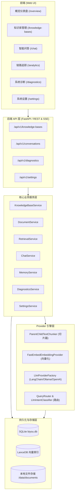

# BiYou 本地知识库问答系统 —— 架构设计文档

本文档详细说明 BiYou 本地 RAG（检索增强生成）问答系统的整体架构、核心设计原理、数据流动路线及技术选型。

---

## 1. 系统总体架构

BiYou 采用前后端分离架构。前端基于 React + TypeScript + Vanilla CSS 构建，后端基于 Python FastAPI + LanceDB + SQLite 构建。系统具备完全脱离外部云端服务在本地单机独立运行的能力。



---

## 2. 核心模块职责分工

### 前端分工 (`frontend/src/features/`)
```text
src/
├── app/                 # 路由 (router.tsx) 与应用装配
├── components/          # 跨功能复用 UI 组件 (Icon, Navigation, AppShell)
├── features/
│   ├── overview/        # 概览仪表盘 (OverviewPage.tsx, overview.css)
│   ├── knowledge-base/  # 知识库与文档管理
│   ├── chat/            # 问答、打字机流式呈现与高亮引用
│   ├── analytics/       # RAG 检索 Trace 链路追溯
│   ├── diagnostics/     # 探针检测、反馈统计与审计日志
│   └── settings/        # LLM / Embedding 运行期配置与连通性测试
└── shared/              # API 统一请求客户端与共享 Hooks
```

### 后端分工 (`backend/app/`)
```text
app/
├── api/                 # 参数校验、HTTP/SSE 协议转换与路由
├── core/                # 配置 (config.py)、日志 (logging.py)
├── middleware/          # X-Trace-ID 追踪中间件 (trace.py)
├── infrastructure/      # 数据持久化实现 (SQLite Repositories, LanceDB Store)
├── modules/             # 领域业务用例 (chat, knowledge_bases, retrieval 等)
└── providers/           # LLM、Embedding、Chunking 插件化实现
```

---

## 3. Key Architectural Designs (核心设计特色)

### 3.1 Parent / Child 双层切片与高精度召回
为了同时兼顾**向量检索精度**与**生成上下文完整度**，系统采用了 Parent/Child 策略：
- **Child Chunk (小切片，256 字符)**：粒度小、语义集中，经 FastEmbed 向量化后写入 LanceDB 索引，用于快速高分召回。
- **Parent Chunk (大地块，1024 字符)**：保存完整的章节段落与上下文。召回 Child 后，自动聚合提取其关联的 Parent Chunk 内容送入 LLM 上下文，彻底解决传统单层切片断章取义的问题。

### 3.2 动态查询路由与意图识别 (`QueryRouter` & `LlmIntentClassifier`)
并不是所有对话都需要触发向量检索。为了避免检索无关文档干扰回答并降低系统延时，系统内置了两级查询路由机制：
1. **规则快速判定**：优先通过确定性正则/关键词识别日常寒暄（如“你好”、“谢谢”）或显式记忆保存指令（如“记住：...”），直接分发路由。
2. **LLM 意图分类与改写**：复杂对话交由 `LlmIntentClassifier` 进行分类，精准划分为以下 4 种意图：
   - `KNOWLEDGE`（知识库检索）：自动触发 RAG 检索，结合多轮历史执行 Query 改写，并挂载高亮引用角标。
   - `GENERAL`（通用闲聊）：直接调用 LLM 问答，同时自动注入用户的长期记忆上下文。
   - `CLARIFICATION`（缺少上下文）：主动生成追问提示，引导用户补充明确对象或完整问题。
   - `MEMORY_CONFIRMATION`（记忆确认）：提示用户格式，引导触发“记住：...”长期记忆持久化。

### 3.3 长期记忆提取与系统提示词注入 (`MemoryService` & `MemoryExtractor`)
系统具备轻量级长期记忆能力，帮助 AI 建立跨会话的个性化用户画像：
1. **记忆提取 (`MemoryExtractor`)**：当用户在对话中发送“记住：我是前端工程师”或“记录：常用技术栈是 Python 和 TS”时，系统自动抽取键值对。
2. **隔离持久化**：长期记忆安全存储于 SQLite `memories` 独立数据表中，避免与临时的聊天历史生命周期耦合。
3. **上下文动态注入**：在后续执行 `GENERAL` 通用问答时，`ChatService` 自动检索当前匹配的记忆列表，并将其作为 `memories` 上下文动态注入到 LLM 系统 Prompt 中，使 AI 回答能够准确识别用户的个人偏好与身份背景。

### 3.4 运行期 LLM 引擎热加载与持久化
用户在「设置」页面更改大模型 Provider（如由 Ollama 切换为 DeepSeek / SiliconFlow）或模型名称时：
1. `SettingsService` 通过 `LlmProviderFactory` 实时重新生成 `LlmProvider` 实例。
2. 动态注入更新 `ChatService` 实例，**无需重启 Backend 进程即可秒级生效**。
3. 自动同步重写落盘至后端 `.env` 文件，确保服务重启后新配置持续有效。

### 3.5 审计日志与脱敏快照机制 (`feedback_audit_logs`)
- **敏感信息保护**：日志中严格脱敏，不记录完整的用户 Key、密钥及用户私密正文。
- **数据快照持久化**：用户评价点赞 (👍)、点踩 (👎) 及重新生成事件，除记录在会话记录外，会同步写入独立的 `feedback_audit_logs` 快照表（无级联删除约束）。即使前端清空聊天历史，后台诊断的 AI 回答质量统计指标依然准确完整。

---

## 4. 技术选型一览

| 模块 | 技术选型 | 选用原因 |
| :--- | :--- | :--- |
| 前端框架 | React 18 + TypeScript + Vite | 快速热更新、强类型约束、轻量敏捷 |
| 前端样式 | Vanilla CSS (CSS Variables + BEM) | 灵活控制、零依赖、无缝支持深浅色主题 |
| 后端 API | Python 3.12 + FastAPI + Uvicorn | 异步高性能、内置 SSE 流式响应与 OpenAPI |
| 包管理 | `uv` | 比 Poetry/Pipenv 更快速、确定性的依赖构建 |
| 关系型数据库 | SQLite 3 (aiosqlite) | 单机零配置、轻量级持久化 |
| 向量数据库 | LanceDB | 嵌入式高性能向量存储，支持 Columnar 格式与快速检索 |
| Embedding 引擎 | FastEmbed (BAAI/bge-small-zh-v1.5) | 本地 CPU 高效运行，无需依赖外部 API |
| LLM 抽象层 | LangChain + OpenAI API 兼容规范 | 支持接入 SiliconFlow、DeepSeek、Ollama 等任意标准模型 |
