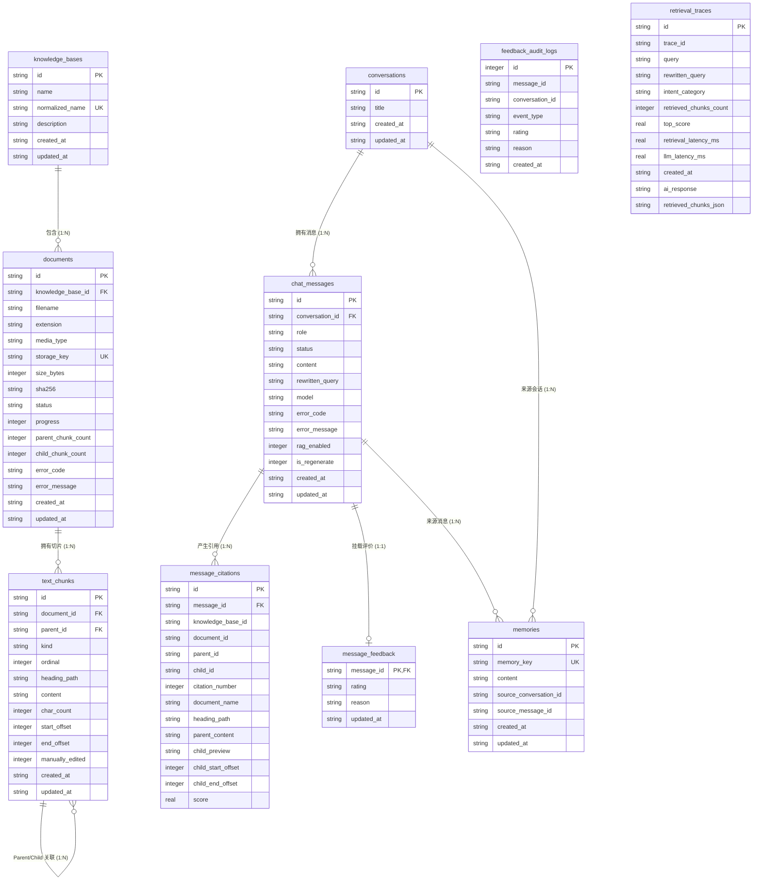

# BiYou 本地知识库问答系统 —— 数据表设计与实体关系文档

本文档详细说明 BiYou 系统所涉及的关系型数据库（SQLite `biyou.db`）表结构设计、字段约束、索引规划、级联关系，以及向量数据库（LanceDB）的数据存储模型。

---

## 1. 数据表实体关系图 (Mermaid ER Diagram)

系统采用了基于外键参照与解耦快照相结合的数据设计。下图清晰列出了各数据表之间的主外键关联关系：

---

## 2. SQLite 数据表结构详细说明

### 2.1 `knowledge_bases` (知识库主表)
用于存储相互独立的知识库空间基本信息。

| 字段名 | 数据类型 | 约束 | 描述 |
| :--- | :--- | :--- | :--- |
| `id` | `TEXT` | `PRIMARY KEY` | 知识库唯一 UUID |
| `name` | `TEXT` | `NOT NULL` | 知识库显示名称 (如“产品架构文档”) |
| `normalized_name` | `TEXT` | `NOT NULL UNIQUE` | 标准化处理后的唯一名称 (防重名) |
| `description` | `TEXT` | `NOT NULL DEFAULT ''` | 知识库业务描述 |
| `created_at` | `TEXT` | `NOT NULL` | 创建时间 (ISO8601 UTC) |
| `updated_at` | `TEXT` | `NOT NULL` | 最近修改时间 |

- **索引**：`idx_knowledge_bases_updated_at` ON (`updated_at` DESC)

---

### 2.2 `documents` (文档表)
记录导入至知识库的物理文件实体与索引构建状态。

| 字段名 | 数据类型 | 约束 | 描述 |
| :--- | :--- | :--- | :--- |
| `id` | `TEXT` | `PRIMARY KEY` | 文档唯一 UUID |
| `knowledge_base_id` | `TEXT` | `NOT NULL, FK` | 外键，关联 `knowledge_bases(id)`，级联删除 |
| `filename` | `TEXT` | `NOT NULL` | 原始文件名 (如 `架构设计.md`) |
| `extension` | `TEXT` | `NOT NULL` | 文件扩展名 (`.md`, `.txt`, `.pdf`) |
| `media_type` | `TEXT` | `NOT NULL` | MIME 类型 (`text/markdown`) |
| `storage_key` | `TEXT` | `NOT NULL UNIQUE` | 本地物理文件相对存储路径 |
| `size_bytes` | `INTEGER` | `NOT NULL` | 文件体积字节数 |
| `sha256` | `TEXT` | `NOT NULL` | 文件 SHA256 哈希值 (防重复导入) |
| `status` | `TEXT` | `NOT NULL` | 状态: `uploading` / `processing` / `ready` / `failed` |
| `progress` | `INTEGER` | `NOT NULL` | 处理进度百分比 (0 - 100) |
| `parent_chunk_count` | `INTEGER` | `NOT NULL DEFAULT 0` | 拆分的 Parent Chunk 数量 |
| `child_chunk_count` | `INTEGER` | `NOT NULL DEFAULT 0` | 拆分的 Child Chunk 数量 |
| `error_code` | `TEXT` | `NULL` | 异常错误码 |
| `error_message` | `TEXT` | `NULL` | 异常详细错误描述 |
| `created_at` | `TEXT` | `NOT NULL` | 上传时间 |
| `updated_at` | `TEXT` | `NOT NULL` | 状态更新时间 |

- **唯一约束**：`UNIQUE(knowledge_base_id, sha256)` 同一知识库内防止重复导入相同文件。
- **索引**：`idx_documents_kb` ON (`knowledge_base_id`, `created_at` DESC)

---

### 2.3 `text_chunks` (切片文本块表)
持久化存储文档解析拆分后的 Parent/Child 结构化文本块。

| 字段名 | 数据类型 | 约束 | 描述 |
| :--- | :--- | :--- | :--- |
| `id` | `TEXT` | `PRIMARY KEY` | 文本块唯一 UUID |
| `document_id` | `TEXT` | `NOT NULL, FK` | 外键，关联 `documents(id)`，级联删除 |
| `parent_id` | `TEXT` | `NULL, FK` | 自引用外键，Child 块关联其所属 Parent 块 ID |
| `kind` | `TEXT` | `NOT NULL` | 切片类型: `'parent'` 或 `'child'` |
| `ordinal` | `TEXT` | `NOT NULL` | 文档内切片顺序序号 |
| `heading_path` | `TEXT` | `NOT NULL DEFAULT ''` | 所属 Markdown 标题路径层级 (如 `架构/后端`) |
| `content` | `TEXT` | `NOT NULL` | 切片文本正文 |
| `char_count` | `INTEGER` | `NOT NULL` | 字符数长度 |
| `start_offset` | `INTEGER` | `NOT NULL DEFAULT 0` | 原始文档内字符起始偏移 |
| `end_offset` | `INTEGER` | `NOT NULL DEFAULT 0` | 原始文档内字符终止偏移 |
| `manually_edited` | `INTEGER` | `NOT NULL DEFAULT 0` | 是否经过人工手动校对 (0/1) |
| `created_at` | `TEXT` | `NOT NULL` | 创建时间 |
| `updated_at` | `TEXT` | `NOT NULL` | 更新时间 |

- **索引**：
  - `idx_chunks_document` ON (`document_id`, `ordinal` ASC)
  - `idx_chunks_parent` ON (`parent_id`)

---

### 2.4 `conversations` (问答会话表)
存储用户的问答会话主题。

| 字段名 | 数据类型 | 约束 | 描述 |
| :--- | :--- | :--- | :--- |
| `id` | `TEXT` | `PRIMARY KEY` | 会话唯一 UUID |
| `title` | `TEXT` | `NOT NULL` | 会话标题 (自动由首句提取生成) |
| `created_at` | `TEXT` | `NOT NULL` | 创建时间 |
| `updated_at` | `TEXT` | `NOT NULL` | 最新问答活跃时间 |

- **索引**：`idx_conversations_updated` ON (`updated_at` DESC)

---

### 2.5 `chat_messages` (聊天消息明细表)
记录会话中的每一轮提问、AI 回答或追问提示。

| 字段名 | 数据类型 | 约束 | 描述 |
| :--- | :--- | :--- | :--- |
| `id` | `TEXT` | `PRIMARY KEY` | 消息唯一 UUID |
| `conversation_id` | `TEXT` | `NOT NULL, FK` | 外键，关联 `conversations(id)`，级联删除 |
| `role` | `TEXT` | `NOT NULL` | 角色: `'user'`, `'assistant'`, `'clarification'` |
| `status` | `TEXT` | `NOT NULL` | 消息生成状态: `'generating'`, `'completed'`, `'failed'` |
| `content` | `TEXT` | `NOT NULL` | 消息正文文本 |
| `rewritten_query` | `TEXT` | `NULL` | QueryRouter 改写后的实际检索关键词 |
| `model` | `TEXT` | `NULL` | 生成该回答使用的 LLM 模型标识 |
| `error_code` | `TEXT` | `NULL` | 生成失败错误码 |
| `error_message` | `TEXT` | `NULL` | 错误详细原因 |
| `rag_enabled` | `INTEGER` | `NOT NULL DEFAULT 0` | 本轮问答是否触发了 RAG 检索 (0/1) |
| `is_regenerate` | `INTEGER` | `NOT NULL DEFAULT 0` | 本条回答是否属于重新生成的结果 (0/1) |
| `created_at` | `TEXT` | `NOT NULL` | 消息创建时间 |
| `updated_at` | `TEXT` | `NOT NULL` | 消息完成时间 |

- **索引**：`idx_messages_conversation` ON (`conversation_id`, `created_at` ASC, `id` ASC)

---

### 2.6 `message_citations` (消息引用出处表)
挂载在 AI 回答下的文档段落引用来源。

| 字段名 | 数据类型 | 约束 | 描述 |
| :--- | :--- | :--- | :--- |
| `id` | `TEXT` | `PRIMARY KEY` | 引用项唯一 UUID |
| `message_id` | `TEXT` | `NOT NULL, FK` | 外键，关联 `chat_messages(id)`，级联删除 |
| `knowledge_base_id` | `TEXT` | `NOT NULL` | 出处知识库 ID |
| `document_id` | `TEXT` | `NOT NULL` | 出处文档 ID |
| `parent_id` | `TEXT` | `NOT NULL` | 关联的 Parent Chunk ID |
| `child_id` | `TEXT` | `NOT NULL` | 召回命中的 Child Chunk ID |
| `citation_number` | `INTEGER` | `NOT NULL` | 引用角标序号 (1, 2, 3...) |
| `document_name` | `TEXT` | `NOT NULL` | 来源文档名称 |
| `heading_path` | `TEXT` | `NOT NULL` | 所属 Markdown 标题路径 |
| `parent_content` | `TEXT` | `NOT NULL` | Parent 段落完整正文 |
| `child_preview` | `TEXT` | `NOT NULL` | Child 精准命中原句预览 |
| `child_start_offset` | `INTEGER` | `NOT NULL DEFAULT 0` | 原文起始偏移 |
| `child_end_offset` | `INTEGER` | `NOT NULL DEFAULT 0` | 原文终止偏移 |
| `score` | `REAL` | `NOT NULL` | 向量召回匹配得分 |

- **唯一约束**：`UNIQUE(message_id, citation_number)`
- **索引**：`idx_citations_message` ON (`message_id`, `citation_number` ASC)

---

### 2.7 `message_feedback` (消息评价表)
记录用户对指定 AI 回答的点赞 (👍) 或点踩 (👎) 评分与原因。

| 字段名 | 数据类型 | 约束 | 描述 |
| :--- | :--- | :--- | :--- |
| `message_id` | `TEXT` | `PRIMARY KEY, FK` | 外键，关联 `chat_messages(id)`，级联删除 |
| `rating` | `TEXT` | `NOT NULL` | 评价分类: `'like'` 或 `'dislike'` |
| `reason` | `TEXT` | `NULL` | 点踩反馈的文字原因描述 |
| `updated_at` | `TEXT` | `NOT NULL` | 评价提交时间 |

---

### 2.8 `feedback_audit_logs` (永久快照审计表)
解耦的永久评价与重新生成审计日志表。该表**不设置外键级联删除约束**，确保用户删除物理对话后，历史满意度统计指标不丢失。

| 字段名 | 数据类型 | 约束 | 描述 |
| :--- | :--- | :--- | :--- |
| `id` | `INTEGER` | `PRIMARY KEY AUTOINCREMENT` | 自增主键 |
| `message_id` | `TEXT` | `NOT NULL` | 目标消息 ID |
| `conversation_id` | `TEXT` | `NOT NULL` | 所属会话 ID |
| `event_type` | `TEXT` | `NOT NULL` | 事件类型: `'feedback'` 或 `'regeneration'` |
| `rating` | `TEXT` | `NULL` | 评价结果 ('like' / 'dislike') |
| `reason` | `TEXT` | `NULL` | 反馈原因 |
| `created_at` | `TEXT` | `NOT NULL` | 审计快照产生时间 |

---

### 2.9 `memories` (长期记忆提取表)
存储系统自动收录的用户个性化记忆与偏好。

| 字段名 | 数据类型 | 约束 | 描述 |
| :--- | :--- | :--- | :--- |
| `id` | `TEXT` | `PRIMARY KEY` | 记忆唯一 UUID |
| `memory_key` | `TEXT` | `NOT NULL UNIQUE` | 记忆规范化 Key (如 `user_role`, `preferred_tech_stack`) |
| `content` | `TEXT` | `NOT NULL` | 记忆详细内容 (如“用户是前端开发工程师”) |
| `source_conversation_id` | `TEXT` | `NOT NULL` | 产生该记忆的来源会话 ID |
| `source_message_id` | `TEXT` | `NOT NULL` | 产生该记忆的来源消息 ID |
| `created_at` | `TEXT` | `NOT NULL` | 记录时间 |
| `updated_at` | `TEXT` | `NOT NULL` | 更新时间 |

- **索引**：`idx_memories_updated` ON (`updated_at` DESC, `id` ASC)

---

### 2.10 `retrieval_traces` (RAG 检索链路追踪表)
记录单次问答检索链路的完整 Trace 数据，供诊断与质量追溯使用。

| 字段名 | 数据类型 | 约束 | 描述 |
| :--- | :--- | :--- | :--- |
| `id` | `TEXT` | `PRIMARY KEY` | Trace 记录 UUID |
| `trace_id` | `TEXT` | `NOT NULL` | HTTP 请求头对应的 `X-Trace-ID` |
| `query` | `TEXT` | `NOT NULL` | 用户原始提问 |
| `rewritten_query` | `TEXT` | `NULL` | 路由改写后的检索查询词 |
| `intent_category` | `TEXT` | `NULL` | 识别出的意图类别 (`KNOWLEDGE`, `GENERAL` 等) |
| `retrieved_chunks_count` | `INTEGER` | `NOT NULL` | 本次召回命中 Child Chunk 总数 |
| `top_score` | `REAL` | `NULL` | 召回最高相似度匹配得分 |
| `retrieval_latency_ms` | `REAL` | `NOT NULL` | 检索阶段耗时 (毫秒) |
| `llm_latency_ms` | `REAL` | `NULL` | 大模型生成首 Token/全流程耗时 (毫秒) |
| `ai_response` | `TEXT` | `NULL` | 大模型生成的最终回答快照 |
| `retrieved_chunks_json` | `TEXT` | `NULL` | 召回切片明细 JSON 序列化数据 |
| `created_at` | `TEXT` | `NOT NULL` | 记录时间 |

- **索引**：`idx_traces_created` ON (`created_at` DESC)

---

## 3. LanceDB 向量数据库存储设计

向量数据库存放在本地目录 `data/vectors/` 下，使用嵌入式 LanceDB 列式引擎。

### 3.1 向量表 (`child_chunks`)
专注于微粒度 Child Chunk 的高性能 Dense Vector 相似度检索。

| 字段名 | 数据类型 | 描述 |
| :--- | :--- | :--- |
| `child_id` | `string` | Child Chunk 唯一标识 (与 SQLite `text_chunks.id` 一致) |
| `parent_id` | `string` | 所属 Parent Chunk 标识 (与 SQLite `text_chunks.parent_id` 一致) |
| `document_id` | `string` | 所属文档 ID |
| `vector` | `vector[384]` | 384 维浮点向量 (基于 FastEmbed `bge-small-zh-v1.5` 生成) |
| `ordinal` | `int32` | 切片顺序号 |
| `start_offset` | `int32` | 原文起始字符偏移 |
| `end_offset` | `int32` | 原文终止字符偏移 |
| `preview_content` | `string` | Child 切片前 240 字符原文预热快照 |
